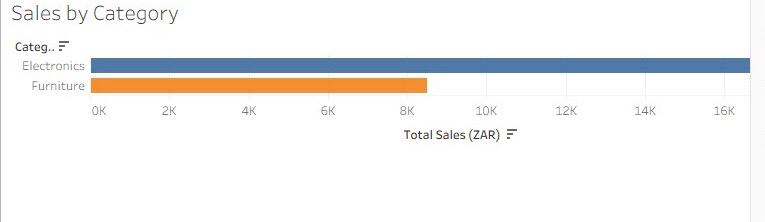
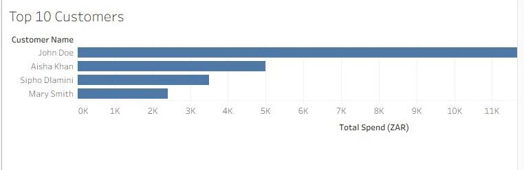
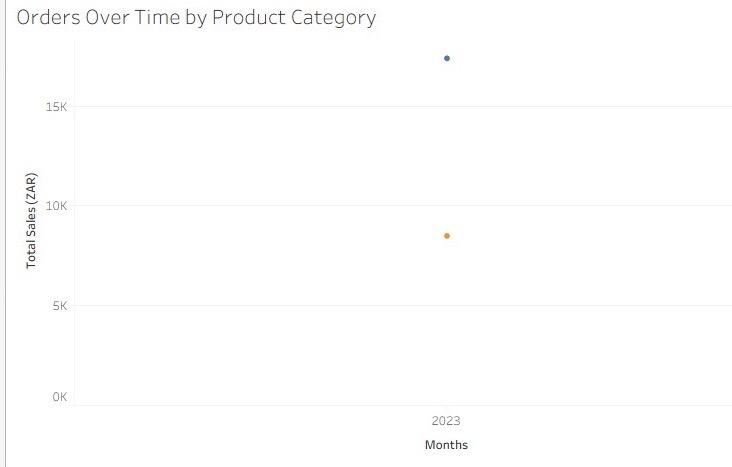

# Retail Sales Data Analysis (SQL, Excel, Tableau)

## Project Overview
This is an end-to-end retail sales data analysis project that demonstrates job-ready data analytics skills. 
The objective is to analyze customer purchasing behavior, product performance, and sales trends, 
and present insights using clear dashboards.

## Tools and Technologies
- SQL Server (SSMS)
- Microsoft Excel
- Tableau Public
- GitHub

## Project Structure

- `01_project_overview.md` – Project goals and business questions
- `02_sql/` – SQL scripts for creating, cleaning, and analyzing data
- `03_cleaned_data/` – Cleaned datasets used for analysis
- `05_tableau/` – Tableau dashboard screenshots

## Data Cleaning (SQL)

- Raw tables were cleaned using SQL queries
- Duplicate records were removed
- Missing values handled
- Text fields standardized
- Cleaned tables exported to Excel for validation

## Data Analysis and Visualizations

The analysis focuses on the following insights:

### Tableau Dashboards

- **Sales Over Time**  
  

- **Top 10 Customers**  
  

- **Sales by Category**  
  

- **Orders Over Time by Product Category**  
  

- **Combined Dashboard**  
  

## Key Skills Demonstrated

- Relational database design
- SQL data cleaning and transformation
- Joins, aggregations, and analytical queries
- Excel data handling
- Tableau dashboard development
- End-to-end analytics workflow
- Professional documentation

## Author

Ntsieni Ndou  
Aspiring Data Analyst
